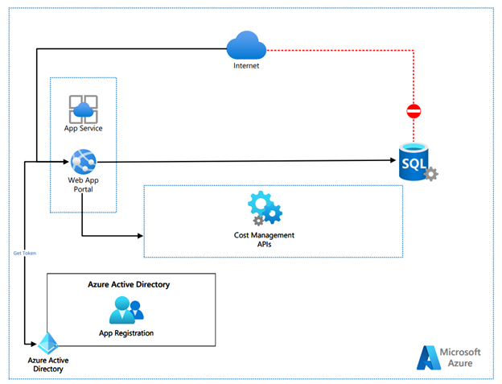
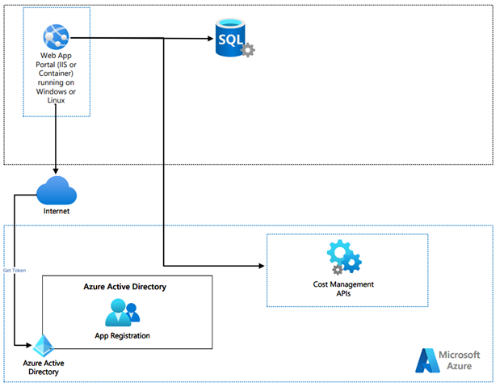

# **Anti-Fraud Dashboard App**

O objetivo desse documento é detalhar a ideia central do app anti-fraud, sua proposta de arquitetura de solução e os componentes de infraestrutura necessários para efetuar a instalação do sistema em nuvem ou on-premise.

**Objetivo do app**

O objetivo do app é disponibilizar um dashboard de visualização dos últimos 8 dias de custo acumulado das subscrições do Azure e seu custo atual, considerando o início do mês até a data presente.

Além do dashboard estão implementados dois mecanismos de background executam verificações de custos a cada quatro horas (esse tempo pode ser customizado) e também um alerta via e-mail caso o consumo atual seja superior a um percentual configurado, por exemplo, 10% ou 20%.

A visualização do Dashboard será mediante website onde o app será instalado (nuvem ou on-premise). A solução não contempla opção de login para visualização de dados.

**Linguagens, ferramentas e tecnologias utilizadas**

- Visual Studio 2022 (ou 2019), ou Visual Studio Code
- C#
- JavaScript
- CSS
- HTML
- SQL Server (qualquer versão, recomendado as mais recentes)
- Azure Active Directory (instalação de um app para conexão e obtenção de token para comunicação com as APIs de consumo)

**Arquitetura de solução e componentes**

_Arquitetura sugerida para nuvem Azure_

_Arquitetura sugerida on-premise_

**Instalação**

As tecnologias envolvidas na solução podem ser baixadas nas seguintes fontes:

Banco de dados

- SQL Server Express: [https://www.microsoft.com/pt-br/sql-server/sql-server-downloads](https://www.microsoft.com/pt-br/sql-server/sql-server-downloads) ou
- SQL Server Basic Service Tier pode ser opção
  - Executar scripts para criar duas tabelas na pasta "infra" do projeto

Aplicação

- .NET 6: [https://dotnet.microsoft.com/en-us/download/dotnet/6.0](https://dotnet.microsoft.com/en-us/download/dotnet/6.0) para instalação on-premise ou Azure Web App via Portal – possibilidade de restringir acesso por IP ([https://docs.microsoft.com/en-us/azure/app-service/app-service-ip-restrictions](https://docs.microsoft.com/en-us/azure/app-service/app-service-ip-restrictions))
- Possibilidade de criação de container Linux

Azure AD

- Registrar uma aplicação com Microsoft Identity Platform - [https://docs.microsoft.com/en-us/azure/active-directory/develop/quickstart-register-app](https://docs.microsoft.com/en-us/azure/active-directory/develop/quickstart-register-app)
- Adicionar um client secret - [https://docs.microsoft.com/en-us/azure/active-directory/develop/quickstart-register-app#add-a-client-secret](https://docs.microsoft.com/en-us/azure/active-directory/develop/quickstart-register-app#add-a-client-secret)
- Associar role "Reader" na subscriptions que serão utilizadas e incluir a aplicação do Microsoft Identity Platform criada previamente - [https://docs.microsoft.com/en-us/azure/role-based-access-control/role-assignments-portal?tabs=current](https://docs.microsoft.com/en-us/azure/role-based-access-control/role-assignments-portal?tabs=current)